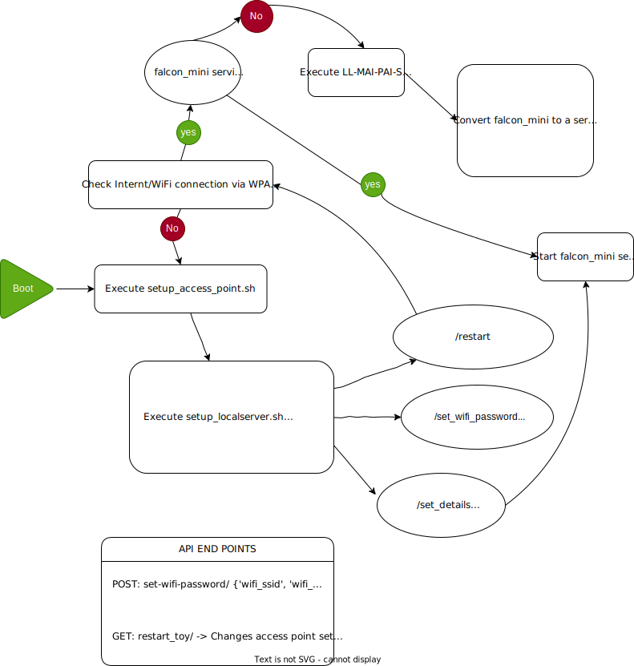

### NOTES

The `boot_service.py` is run by `falcon_boot.service` (systemctl service) which runs checks and decided whether to run `falcon_mini.service` or not. Directory values are ambigous and will depend on the system you are on. 

